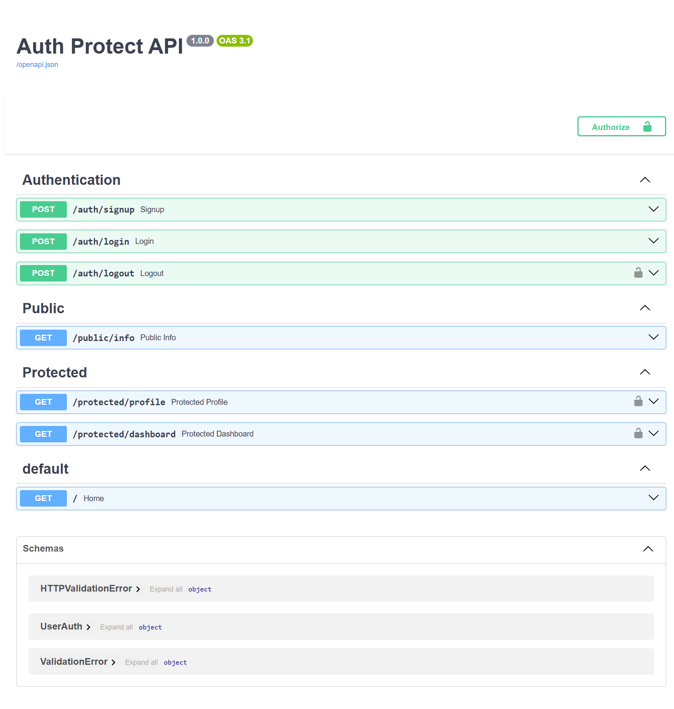

# Auth Protect API

This project is a FastAPI authentication demo that uses Supabase Auth to handle sign up, log in, token verification, and logout. Public endpoints stay open, while protected endpoints require a bearer token in the `Authorization` header.

## Setup

1. Create a `.env` file in this folder with your Supabase values.
2. Use these variables:

```env
SUPABASE_URL=your_project_url
SUPABASE_KEY=your_anon_key
PORT=3000
```

3. Install dependencies:

```bash
pip install -r requirements.txt
```

## Run

Start the server from `Week-4/Week-4/app`:

```bash
python main.py
```

The server should report that it is running and connected to Supabase.

## Swagger UI

Open `http://localhost:3000/docs`. Protected routes use FastAPI's bearer auth security scheme, so the lock icon and Authorize button are available in Swagger UI.



## API Reference

| Method | Route | Auth | Purpose |
| --- | --- | --- | --- |
| POST | `/auth/signup` | No | Create a new user account |
| POST | `/auth/login` | No | Log in and return access and refresh tokens |
| POST | `/auth/logout` | Yes | Revoke the current bearer token session |
| GET | `/public/info` | No | Return public information |
| GET | `/protected/profile` | Yes | Return the authenticated user's secure profile data |
| GET | `/protected/dashboard` | Yes | Example protected route guarded by the same dependency |

## Notes

- The `.env` file is ignored by Git.
- `GET /protected/profile` rejects missing, malformed, invalid, or expired bearer tokens with `401`.
- `POST /auth/signup` returns `201` on success.
- `POST /auth/logout` returns `204` on success.
